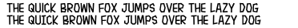

# About Me
I'm a designer/developer who lettered comic books professionally for nearly a decade. I'm inspired by the comics that I've worked on and the comics that I read. I provide these fonts for free with a very lax license to support the comics community, but I ask that you please do not upload them anywhere else. 

Several of these fonts (like Spicy Noodles) are tailor-made for a specific localization need in manga lettering, but feel free to use them however you'd like. 

# Fonts 
## Bean Burrito

Soft and friendly font inspired by my dog.

- Glyph count: 377
- Weights: 4
- Download: [Bean Burrito.zip](https://github.com/saraoswald/fonts/blob/master/ZIP/Bean%20Burrito.zip)

#### Regular

#### Italic

#### Bold

#### Bold Italic

## Bestagon

A geometric font with only sharp edges.

- Glyph count: 346
- Weights: 6
- Download: [Bestagon.zip](https://github.com/saraoswald/fonts/blob/master/ZIP/Bestagon.zip)

#### Regular

#### Italic

#### Bold

#### Bold Italic

#### Thin

#### Thin Italic

