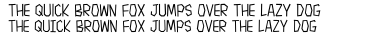
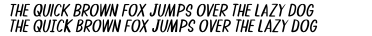
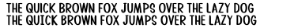

# About Me
I'm a designer/developer who lettered comic books professionally for nearly a decade. I'm inspired by the comics that I've worked on and the comics that I read. I provide these fonts for free with a very lax license to support the comics community, but I ask that you please do not upload them anywhere else. 

Several of these fonts (like Spicy Noodles) are tailor-made for a specific localization need in manga lettering, but feel free to use them however you'd like. 

If you'd like to support me, feel free to buy me a slice of pizza on [Ko-fi  @salinsley](https://ko-fi.com/salinsley). You can also follow me there if you'd like to get updates. 

# Fonts 
## Bean Burrito

Soft and friendly font inspired by my dog.

- Glyph count: 377
- Weights: 4
- Download: [Bean Burrito.zip](https://github.com/saraoswald/fonts/blob/master/ZIP/Bean%20Burrito.zip)

#### Regular

#### Italic

#### Bold

#### Bold Italic

## Bestagon

A geometric font with only sharp edges.

- Glyph count: 346
- Weights: 6
- Download: [Bestagon.zip](https://github.com/saraoswald/fonts/blob/master/ZIP/Bestagon.zip)

#### Regular

#### Italic

#### Bold

#### Bold Italic

#### Thin

#### Thin Italic

## Boba Date

A cutesy font inspired by shojo manga.

- Glyph count: 354
- Weights: 4
- Download: [Boba Date.zip](https://github.com/saraoswald/fonts/blob/master/ZIP/Boba%20Date.zip)

#### Regular

#### Italic

#### Bold

#### Bold Italic

## Cryptid

A sketchy font inspired by a supernatural comic. 

- Glyph count: 356
- Weights: 2
- Download: [Cryptid.zip](https://github.com/saraoswald/fonts/blob/master/ZIP/Cryptid.zip)

#### Regular

#### Italic

## Pretzel

A mixed-case font with a whimsical feel. 

- Glyph count: 478
- Weights: 4
- Download: [Pretzel.zip](https://github.com/saraoswald/fonts/blob/master/ZIP/Pretzel.zip)

#### Regular

#### Italic

#### Bold

#### Bold Italic

## Rosehip

A condensed font inspired by Steve Dutro's lettering in the Revolutionary Girl Utena manga. 

- Glyph count: 364
- Weights: 4
- Download: [Rosehip.zip](https://github.com/saraoswald/fonts/blob/master/ZIP/Rosehip.zip)

#### Regular

#### Italic

#### Bold

#### Bold Italic

## Soapy Hands

The first full font I ever designed!

- Glyph count: 227
- Weights: 6
- Download: [Soapy Hands.zip](https://github.com/saraoswald/fonts/blob/master/ZIP/Soapy%20Hands.zip)

#### Regular

#### Italic

#### Medium

#### Medium Italic

#### Bold

#### Bold Italic

## Spicy Noodles

A spiky font with lots of character.

- Glyph count: 316
- Weights: 2
- Download: [Spicy Noodles.zip](https://github.com/saraoswald/fonts/blob/master/ZIP/Spicy%20Noodles.zip)

#### Regular

#### Italic

